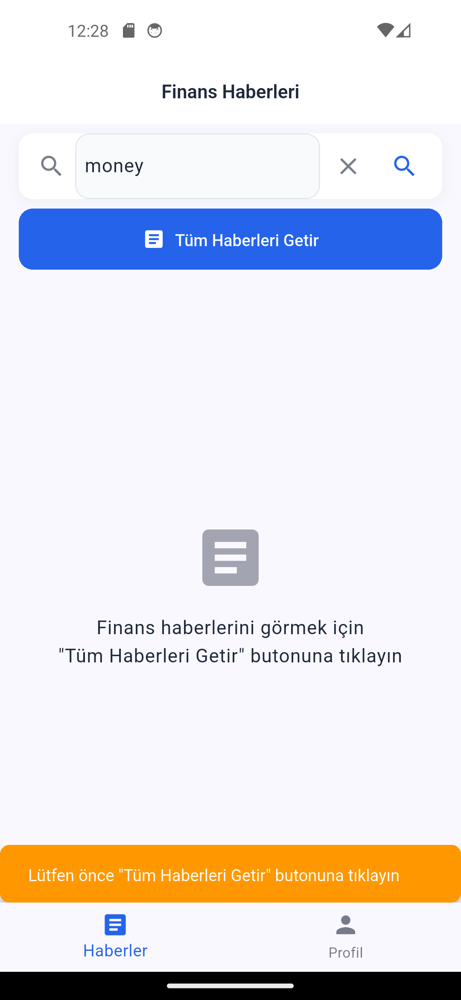
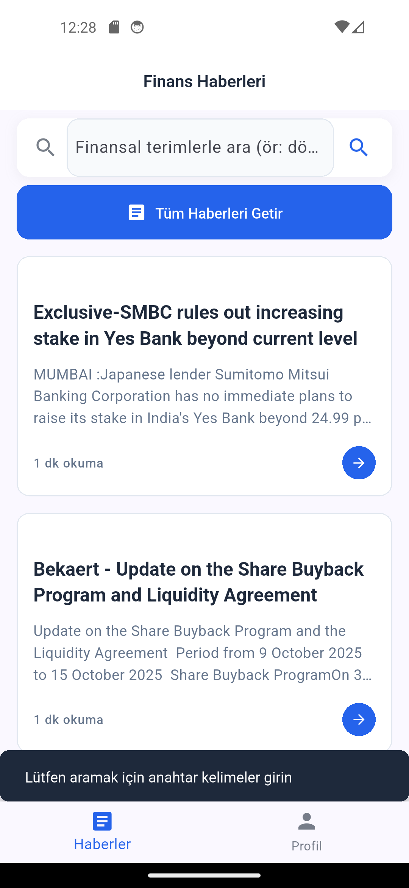
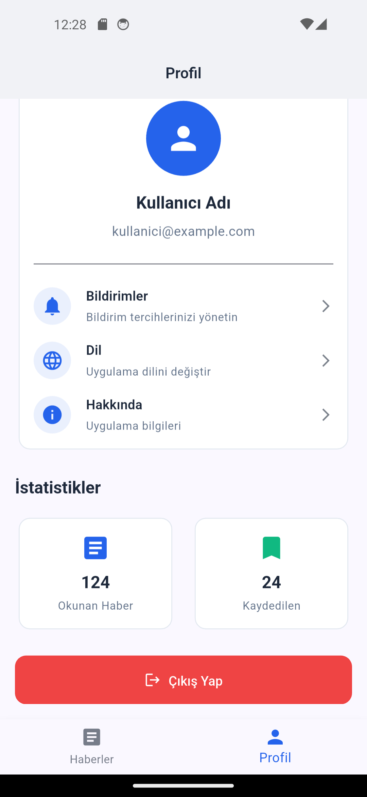

# Finans Haberleri Uygulaması

[](https://flutter.dev)
[](https://dart.dev)
[](LICENSE)

## 📱 Uygulama Tanıtımı

Finans Haberleri Uygulaması, kullanıcıların güncel finansal haberleri takip edebilmesi için geliştirilmiş modern bir mobil uygulamadır. Bu uygulama, temiz mimari prensiplerine uygun olarak geliştirilmiş ve performans odaklı tasarlanmıştır.

Uygulama, kullanıcıların:
- Güncel finans haberlerini görüntülemesini
- Haberleri anahtar kelimelere göre aramasını
- Haber detaylarını web tarayıcısında görüntülemesini
sağlar.


## 🏗️ Mimari

Bu proje, Flutter Clean Architecture prensiplerine uygun olarak geliştirilmiştir. Katmanlar arasında bağımlılıkların doğru şekilde yönetilmesi ve test edilebilirliğin artırılması hedeflenmiştir.

### Katman Yapısı
```
lib/
├── core/              # Çekirdek bileşenler (tema, dependency injection, utils)
├── data/              # Veri katmanı (datasources, models, repositories)
├── domain/            # İş mantığı katmanı (entities, repositories, usecases)
├── features/          # Özellik modülleri
│   ├── home/          # Ana ekran
│   ├── news/          # Haberler özelliği
│   ├── profile/      # Profil yönetimi
│   └── splash/       # Açılış ekranı
└── main.dart         # Uygulama giriş noktası
```

### Kullanılan Teknolojiler
- **Flutter**: UI framework
- **Dart**: Programlama dili
- **Bloc/Cubit**: State management
- **GetIt**: Dependency injection
- **HTTP**: API istemcisi
- **URL Launcher**: Harici bağlantılar

## 🚀 Kurulum

### Gereksinimler
- Flutter SDK (3.8.1 veya üzeri)
- Dart SDK (3.8.1 veya üzeri)
- Android Studio / Xcode (platforma göre)

### Kurulum Adımları
```bash
# Repoyu klonlayın
git clone <repo-url>
cd finance_news_app

# Gerekli paketleri yükleyin
flutter pub get

# Uygulamayı çalıştırın
flutter run
```

## 📸 Ekran Görüntüleri

<p float="left">
  
  
  
  
</p>

## 🔗 İlgili Projeler

Bu uygulamanın backend servisleri için aşağıdaki projeye göz atabilirsiniz:

[Finans Haberleri Backend Servisi](https://github.com/berkecibir/finance_news_python_backend)

## 🎯 Özellikler

- [x] Temiz mimari uygulaması (Clean Architecture)
- [x] Modern UI/UX tasarımı
- [x] Performans optimizasyonu
- [x] Responsive tasarım
- [x] Hata yönetimi
- [x] State management (Cubit)
- [x] Dependency injection
- [x] Splash ekranı
- [x] Haber arama
- [x] Pull-to-refresh desteği

## 📦 Paketler

```yaml
dependencies:
  flutter:
    sdk: flutter
  http: ^1.5.0
  url_launcher: ^6.3.1
  flutter_bloc: ^8.1.6
  get_it: ^8.0.2

dev_dependencies:
  flutter_test:
    sdk: flutter
  flutter_lints: ^5.0.0
  flutter_launcher_icons: ^0.14.1
```

## 🤝 Katkı

Katkıda bulunmak isterseniz:

1. Forklayın (`https://github.com/berkecibir/finance_news_flutter/fork`)
2. Yeni bir branch oluşturun (`git checkout -b feature/YeniOzellik`)
3. Değişikliklerinizi commit edin (`git commit -am 'Yeni özellik eklendi'`)
4. Branch'inizi push edin (`git push origin feature/YeniOzellik`)
5. Yeni bir Pull Request oluşturun

## 📝 Lisans

Bu proje MIT lisansı ile lisanslanmıştır. Detaylar için [LICENSE](LICENSE) dosyasına bakınız.

## 👨‍💻 Geliştirici

**Berke Atahan** - [berkecibir](https://github.com/berkecibir)

Bu proje, frontend ve backend uygulamalarının birlikte geliştirilmesiyle yazılım becerilerinin artırılması amacıyla oluşturulmuştur.